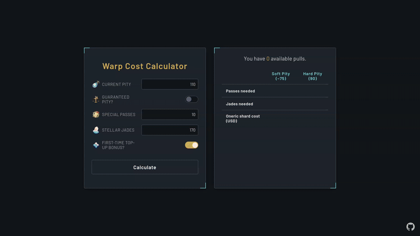

# Honkai: Star Rail Warp Cost Calculator

> ⚠️ **Warning:** This project is in alpha. Features are incomplete, and bugs are likely. Use at your own risk!

A warp cost calculator for Honkai: Star Rail. See exactly how many pulls, passes, and Stellar Jades you need to reach soft or hard pity. Get a total cost estimate and list of optimal Oneiric Shard packs to purchase based on your regional currency.

## Demo

Try the live calculator here: [hsr-calculator](https://kitbur.github.io/hsr-calculator/)

## Features

-   **Pity Calculation:** Calculates pulls needed for soft (75/150) and hard (90/180) pity.
-   **Resource Tracking:** Accounts for your current pity, Stellar Jades, and Special Passes.
-   **Dynamic Regional Pricing:** Fetches up-to-date pricing for a variety of regions to provide accurate cost estimates in local currency.
-   **First-Time Bonus Toggle:** Includes the option to factor in the first-time top-up bonus for Oneiric Shard packs.
-   **Cost-Effective Breakdown:** Shows a recommended combination of Oneiric Shard packs to purchase for the most efficient cost.

## Roadmap

-   **v1.0 Release Goals:**
-   [X] Implement toggles for individual first-time top-up bonuses for each shard pack.
-   [X] Regional prices.
-   [ ] Account for Express Pass and Nameless Honor.
-   [ ] Input validation and error handling.
    -   [ ] Forbid strings.
    -   [ ] Don't let calculations go below zero.
-   [ ] Toggle all option in the top-up bonus input section.
-   [X] Visible indicator for bonus shards.
-   [ ] Dynamic pull totals depending on 50/50 toggle.