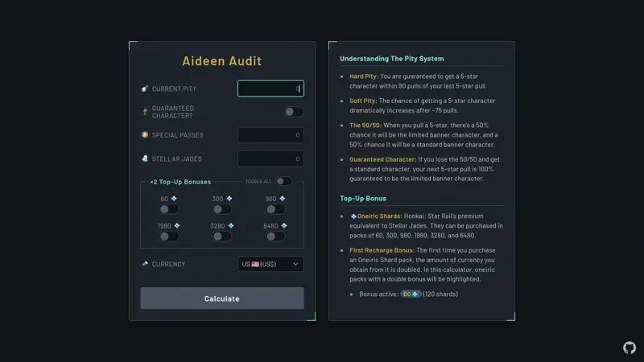

# Aideen Audit

### The True Cost of Your Next Honkai: Star Rail 5-Star.

[](https://opensource.org/licenses/MIT)

Aideen Audit is a comprehensive financial planning tool for Honkai: Star Rail players. It moves beyond simple pull counting to provide a detailed audit of the real-world cost required to secure your next 5-star character, featuring dynamic, region-specific pricing.

<p align="center">
    
</p>

<p align="center">
    <a href="https://kitbur.github.io/aideen-audit/">
        
    </a>
</p>

## Key Features

- **Pity Planning:** Calculates the exact pulls needed for both soft (75/150) and hard (90/180) pity thresholds, accounting for your guaranteed status.
- **Real-World Cost Analysis:** See the estimated total cost of your required pulls, calculated using a cost-effective combination of Oneiric Shard packs.
- **Global Currency Support:** Select your local region to get accurate pricing data and cost estimates in your own currency. No more manual conversions!
- **Resource Tracking:** Input your current pity, Stellar Jades, and Special Passes.
- **First-Time Bonus Modeling:** Toggle first-time purchase bonuses for each individual Oneiric Shard pack to see how they impact your overall cost, allowing for precise budget optimization.
- **Shopping List:** Generates an optimal shopping list of efficient top-up purchases.

## Technologies

<p align="left">
    
    
    
    
</p>

## Development & Testing

This project uses [Node.js](https://nodejs.org/) to manage development dependencies and run an automated test suite with [Vitest](https://vitest.dev/).

### Getting Started

To run this project locally for development or to run the tests:

1.  **Clone the repository:**

    ```bash
    git clone https://github.com/kitbur/aideen-audit.git
    ```

2.  **Install dependencies:**

    ```bash
    npm install
    ```

3.  **Run the test suite:**
    ```bash
    npm test
    ```

## Contributing

Contributions, issues, and feature requests are welcome! Feel free to check the [issues page](https://github.com/kitbur/aideen-audit/issues). If you'd like to contribute, please fork the repository, use a feature branch, and make a pull request.
